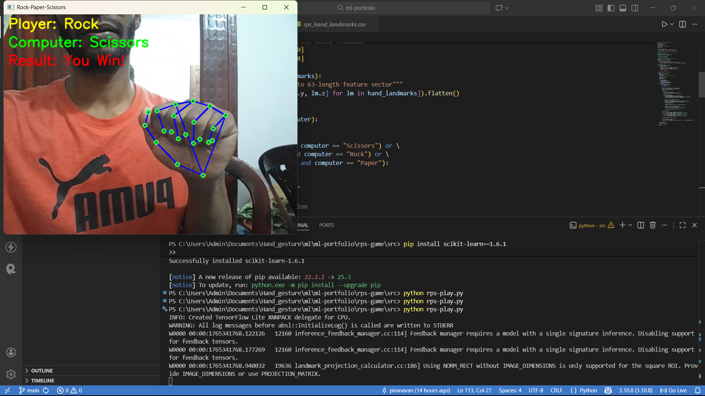
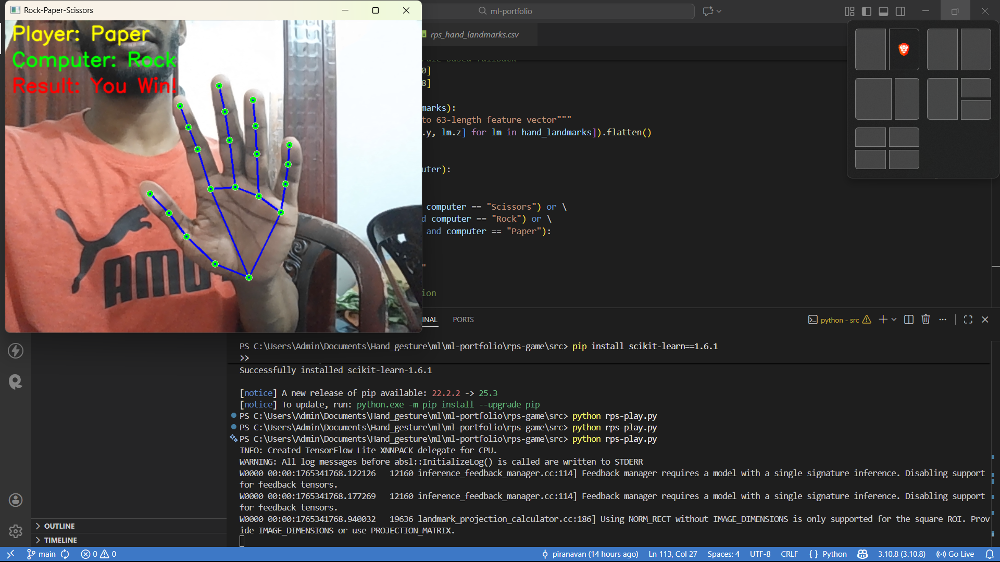
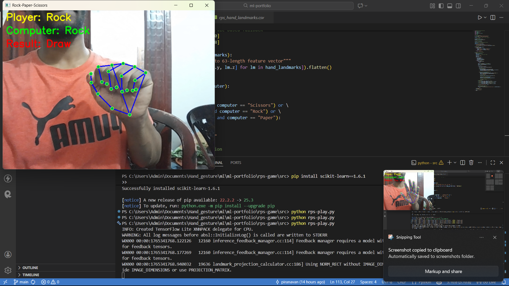
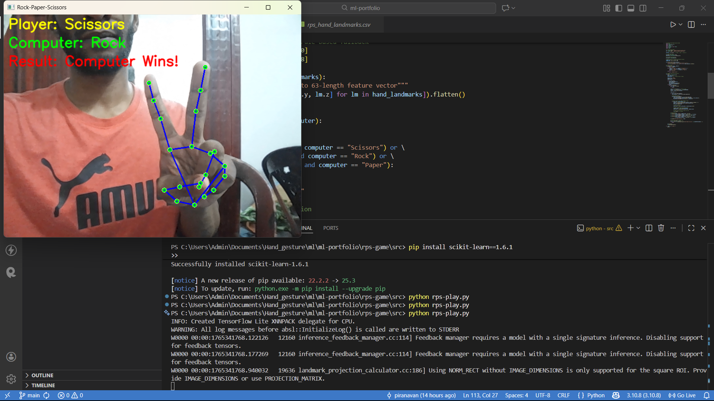
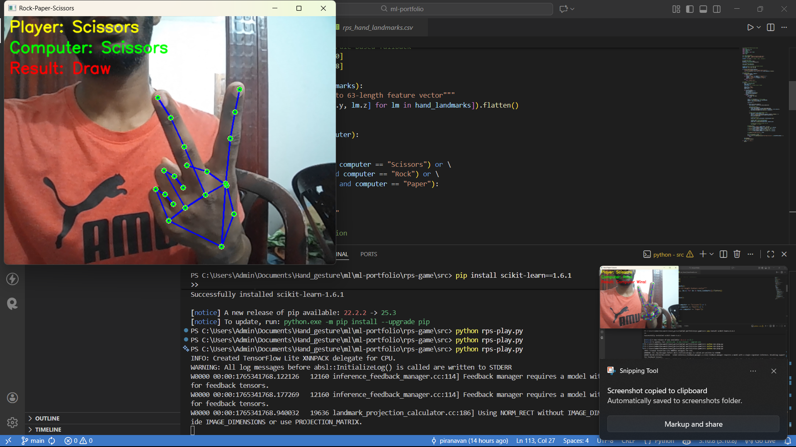

# ML-Based Rock-Paper-Scissors Game

**Description:**  
Play Rock-Paper-Scissors against the computer using real-time hand gesture recognition. The game uses a machine learning model trained on hand landmark positions captured via MediaPipe to classify gestures as Rock, Paper, or Scissors.

**Technologies:**  
Python, OpenCV, MediaPipe, Scikit-Learn, NumPy, Joblib

---

## Features
- Real-time gesture recognition using webcam
- ML model trained on hand landmark dataset
- Frame smoothing for stable predictions
- Interactive game with computer opponent
- Shows player gesture, computer move, and result on screen

---

## Folder Structure
```

rps-ml-game/
rps-ml-game/
├─ data/                       # CSV dataset of hand landmarks
├─ images/                     # Screenshots or GIFs of the game
│  ├─ img1.png             # Example screenshot of the game
│  └─ img2.png              # Optional workflow/architecture diagram
├─ models/                     # Trained ML model and label encoder
│  ├─ rps_gesture_model.pkl
│  └─ rps_label_encoder.pkl
├─ src/                        # Source code
│  ├─ collect_data.py          # Capture hand landmark data
│  ├─ train_model.py           # Train ML model
│  └─ play_rps.py              # Real-time game
├─ README.md                   # Project documentation
└─ requirements.txt            # Python dependencies


````

---

## Installation
1. Clone the repo:
```bash
git clone https://github.com/your-username/rps-ml-game.git
cd rps-ml-game
````

2. Install dependencies:

```bash
pip install -r requirements.txt
```

---

## How to Run

Run the game with:

```bash
python src/play_rps.py
```

* Press **ESC** to exit.
* Ensure your webcam is connected.

---

## Usage

1. Show Rock, Paper, or Scissors gesture to the camera.
2. The ML model will detect your gesture in real-time.
3. The computer will randomly select a move.
4. The game displays the winner on screen.

---

## Demo







